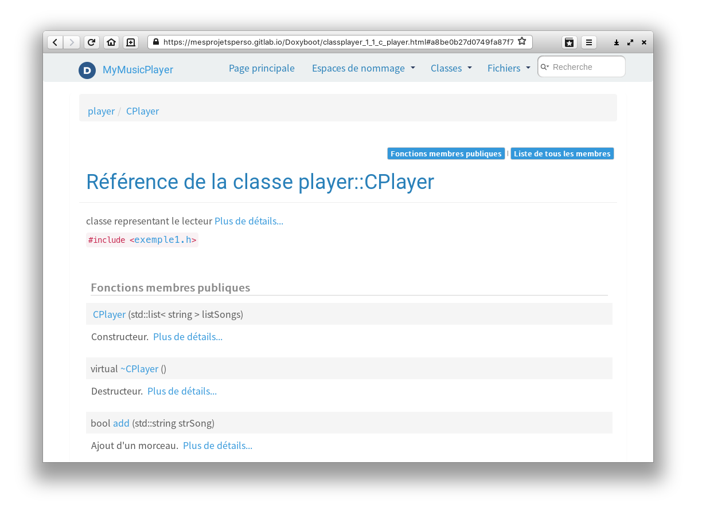

### Présentation

Doxyboot est un projet Doxygen pré-configuré avec les caractéristiques suivantes :
- Intégration du framework Bootstrap pour générer une documentation html "moderne" ;
- Intégration d'un fichier .gitlab-ci.yml permettant de générer et déployer la documentation sur Gitlab.

### Pré-requis
Pour utiliser Doxyboot, les pré-requis suivants sont nécessaires :
- disposer d'une connexion d'une internet
- avoir installer Doxygen sur sa machine

### Utilisation
- clôner ou télécharger ce *repository*.
- placer les codes source documentés avec Doxygen dans le dossier *src*
- personnaliser (optionnel) le logo situé dans le dossier */doxygen/img* (fichier png uniquement, sinon nécessité d'adapter le tag *PROJECT_LOGO* du fichier *Doxyfile*).
- générer la documentation via la commande suivante:
``` bash
cd doxygen
doxygen
```
- envoyer le projet sur Gitlab
- l'URL de la page présentant la documentation générée est consultable depuis Gitlab en allant dans la section *Settings --> Pages*


### Aperçu du type de résultat obtenu




